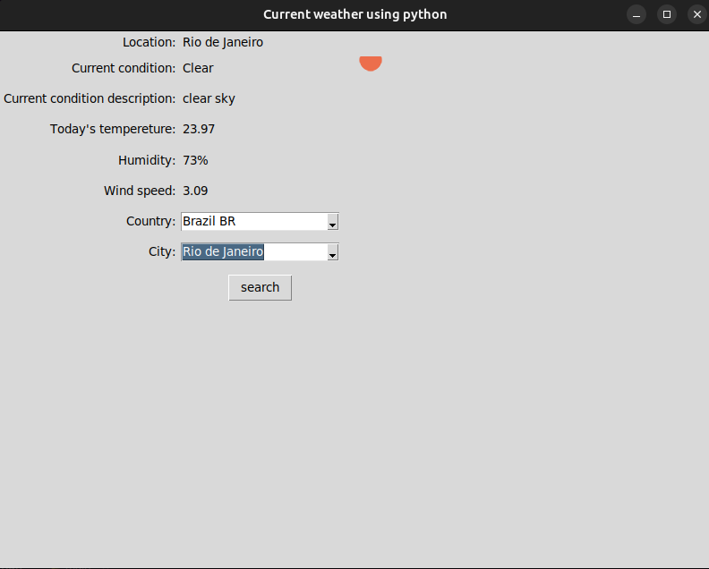

# Weather App with Tkinter



This is a Python-based weather application that provides real-time weather information using Tkinter for the GUI.

## Features

- Automatically detects user's location based on IP address.
- Allows users to search for weather information in any city around the world.
- Displays current weather condition, description, temperature, humidity, and wind speed.
- Provides an icon representing the current weather condition.

## Getting Started

### Prerequisites

- Python 3.x
- Tkinter (usually included in standard Python installations)
- [PIL](https://pillow.readthedocs.io/en/stable/installation.html) (Python Imaging Library) for handling images

### Installing

1. Clone the repository:
   ```
   git clone https://github.com/yourusername/PythonWeatherAppTk.git
   
   ```

2. Navigate to the project directory:
   ```
   cd PythonWeatherAppTk
   ```
3. Run the application:
   ```
   python main.py
   ```
## Usage

1. The app will automatically detect your location based on your IP address and display the weather information.
2. To search for weather in a specific city, select the desired country and city from the dropdown menus and click the "Search" button.
3. The app will display the weather information for the selected location.

## Contributing

If you'd like to contribute, please fork the repository and create a pull request. You can also create an issue to report a bug or request a feature.

## License

This project is licensed under the [MIT License](LICENCE).

## Acknowledgments

- Thanks to the following APIs for providing weather data:
- [ipdata](https://ipdata.co/)
- [OpenWeatherMap](https://openweathermap.org/)
